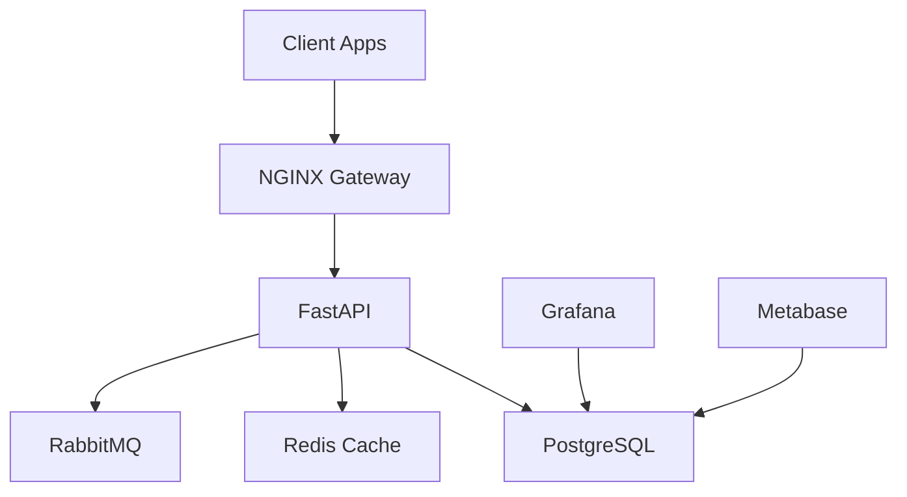
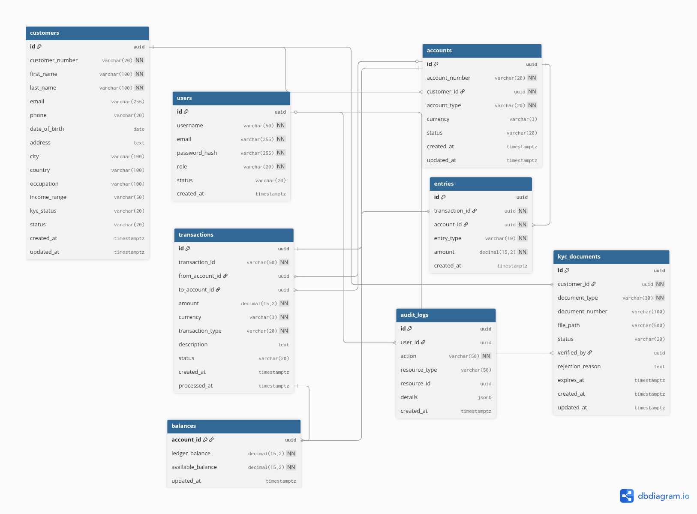

# 🏦 CoreX Banking System

<div align="center">
*A modern, modular core banking engine for digital banks, microfinance institutions, and fintech startups*

[](https://fastapi.tiangolo.com)
[](https://python.org)
[](https://postgresql.org)
[](https://docker.com)
[](https://fly.io)

</div>

## ✨ Features

### 🏦 Core Banking
- **Customer Management**: Complete customer lifecycle with enhanced onboarding
- **Account Management**: Multi-type accounts (Savings, Current, Loan)
- **Double-Entry Accounting**: ACID-compliant transaction processing
- **Multi-Currency Support**: Handle global currencies safely
- **Real-time Balances**: Instant balance updates and tracking

### 🔐 KYC & Compliance
- **Document Upload**: Secure identity document management
- **Verification Workflow**: Role-based document approval process
- **Compliance Tracking**: Complete audit trail for regulatory requirements
- **Risk Assessment**: Configurable KYC requirements and thresholds

### 🛡️ Security & Access
- **OAuth2 + JWT**: Industry-standard authentication
- **Role-Based Access**: Admin, Teller, Auditor, and API user roles
- **Audit Logging**: Immutable transaction and action history
- **Data Encryption**: Secure data handling and storage

## 🚀 Quick Start

### 📊 Live Demo

**🌐 Production Deployment**: [https://corex-banking.fly.dev](https://corex-banking.fly.dev)

- **API Documentation**: [https://corex-banking.fly.dev/docs](https://corex-banking.fly.dev/docs)
- **Health Check**: [https://corex-banking.fly.dev/health](https://corex-banking.fly.dev/health)

### 🛠️ Prerequisites

- **Docker & Docker Compose** (recommended)
- **Python 3.11+** (for local development)
- **PostgreSQL 15+** (for production)
- **Git** (for cloning repository)

### 🐳 Docker Setup (Recommended)

1. **Clone the repository**:
```bash
git clone https://github.com/manziosee/CoreX.git
cd CoreX
```

2. **Quick start**:
```bash
make setup  # Copy .env and start services
```

3. **Or manual setup**:
```bash
cp .env.example .env
docker-compose up -d
```

4. **Access the services**:

| Service | URL | Credentials |
|---------|-----|-------------|
| 🏦 **CoreX API** | [http://localhost:8000](http://localhost:8000) | - |
| 📚 **API Docs** | [http://localhost:8000/docs](http://localhost:8000/docs) | - |
| 📈 **Grafana** | [http://localhost:3000](http://localhost:3000) | `admin` / `admin123` |
| 🐇 **RabbitMQ** | [http://localhost:15672](http://localhost:15672) | `guest` / `guest` |
| 📉 **Metabase** | [http://localhost:3001](http://localhost:3001) | - |

### 💻 Local Development

1. **Setup database and dependencies**:
```bash
# Quick setup with local PostgreSQL
./run_local.py

# Or manual setup
python3 setup_db.py          # Create database
pip install -r requirements.txt
python3 manage_db.py upgrade # Run migrations
uvicorn app.main:app --reload # Start API
```

2. **Development with Docker services**:
```bash
make dev-full  # PostgreSQL + Redis + RabbitMQ in Docker
```

3. **Hybrid setup** (local DB + Docker services):
```bash
make dev-docker  # Redis + RabbitMQ in Docker, local PostgreSQL
```

### 🧪 Testing

```bash
# Run all tests
make test

# Or directly with pytest
pytest -v

# Test specific modules
pytest tests/test_kyc.py -v
```

## 📚 API Documentation

### 🔗 Interactive Documentation
- **Swagger UI**: [http://localhost:8000/docs](http://localhost:8000/docs)
- **ReDoc**: [http://localhost:8000/redoc](http://localhost:8000/redoc)
- **OpenAPI JSON**: [http://localhost:8000/openapi.json](http://localhost:8000/openapi.json)

### 🔑 Authentication

**Default Admin Credentials**: `admin` / `admin123`

```bash
# Get access token
curl -X POST "http://localhost:8000/auth/token" \
  -H "Content-Type: application/x-www-form-urlencoded" \
  -d "username=admin&password=admin123"

# Use token in requests
curl -H "Authorization: Bearer <your-token>" \
  "http://localhost:8000/customers/"
```

### 📦 Postman Collection

Import the complete API collection:
```bash
# Import postman_collection.json into Postman
# Auto-update collection from API
make postman-update
```

## 🏧 Architecture

### 📊 System Overview



### 🛠️ Technology Stack

| Layer | Technology | Purpose |
|-------|------------|----------|
| **API** | FastAPI + Uvicorn | REST API with auto-documentation |
| **Database** | PostgreSQL 15+ | ACID transactions & data integrity |
| **Cache** | Redis | Fast balance lookups & sessions |
| **Queue** | RabbitMQ | Async processing & notifications |
| **Auth** | OAuth2 + JWT | Secure authentication |
| **Monitoring** | Grafana + Loki | Observability & logging |
| **Reporting** | Metabase | Business intelligence |
| **Deployment** | Docker + Fly.io | Containerized cloud deployment |

## 📊 Database Schema

### 🗺️ Entity Relationship Diagram



### 📊 Key Tables

| Table | Purpose | Records |
|-------|---------|----------|
| **customers** | Customer profiles & KYC status | Customer data |
| **accounts** | Bank accounts (Savings/Current/Loan) | Account records |
| **kyc_documents** | Identity verification documents | KYC files |
| **balances** | Real-time account balances | Balance tracking |
| **transactions** | Transaction records | Transaction history |
| **entries** | Double-entry journal entries | Accounting entries |
| **users** | Staff and admin accounts | System users |
| **audit_logs** | Complete audit trail | Compliance records |

### 🔗 Relationships
- **customers** (1) → **accounts** (M)
- **customers** (1) → **kyc_documents** (M)
- **accounts** (1) → **balances** (1)
- **transactions** (1) → **entries** (M)
- **users** (1) → **audit_logs** (M)

**📚 Documentation**: [Database Schema Details](docs/DATABASE.md)

## 🚀 Deployment

### 🌐 Production (Fly.io)

**Live Demo**: [https://corex-banking.fly.dev](https://corex-banking.fly.dev)

```bash
# One-command deployment
./deploy.sh

# Or manual deployment
flyctl auth login
flyctl launch --no-deploy
flyctl deploy --dockerfile Dockerfile.fly
```

### 🐳 Docker Production

```bash
# Build and run production container
docker build -f Dockerfile.fly -t corex-banking .
docker run -p 8000:8000 corex-banking
```

### 🛠️ Database Management

```bash
# Setup database and migrations
make db-setup

# Create new migration
make db-migrate MESSAGE="add new feature"

# Upgrade to latest
make db-upgrade

# View migration history
make db-history
```

**📚 Deployment Guide**: [README-DEPLOY.md](README-DEPLOY.md)

## 📚 Documentation

| Document | Description |
|----------|-------------|
| [Database Schema](docs/DATABASE.md) | Complete database documentation |
| [KYC Feature](docs/KYC_FEATURE.md) | KYC implementation details |
| [ERD Specification](docs/ERD_SPECIFICATION.md) | Entity relationship diagrams |
| [Deployment Guide](README-DEPLOY.md) | Production deployment instructions |
| [API Collection](postman_collection.json) | Postman API collection |

## 🔧 Development Commands

```bash
# Database operations
make db-setup          # Setup database and migrations
make db-migrate        # Create new migration
make db-upgrade        # Apply migrations

# Development
make dev              # Start with local PostgreSQL
make dev-docker       # Start with Docker services
make test             # Run tests

# API documentation
make postman-update   # Update Postman collection
make docs-db          # View database documentation

# Docker operations
make build            # Build Docker images
make up               # Start all services
make down             # Stop all services
make logs             # View logs
```

## 🤝 Contributing

1. **Fork** the repository
2. **Create** a feature branch (`git checkout -b feature/amazing-feature`)
3. **Commit** your changes (`git commit -m 'Add amazing feature'`)
4. **Push** to the branch (`git push origin feature/amazing-feature`)
5. **Open** a Pull Request

### 📝 Development Guidelines
- Follow PEP 8 style guidelines
- Add tests for new features
- Update documentation
- Ensure all tests pass

## 📈 Project Status

- ✅ **Core Banking Engine**: Complete with double-entry accounting
- ✅ **KYC System**: Document upload and verification workflow
- ✅ **API Documentation**: Comprehensive Swagger/OpenAPI docs
- ✅ **Database Migrations**: Alembic-based schema management
- ✅ **Docker Support**: Full containerization with Docker Compose
- ✅ **Cloud Deployment**: Production-ready on Fly.io
- ✅ **Monitoring**: Grafana + Loki observability stack
- ✅ **Testing**: Pytest test suite with CI/CD ready

## 🔗 Links

- **🌐 Live Demo**: [https://corex-banking.fly.dev](https://corex-banking.fly.dev)
- **📚 API Docs**: [https://corex-banking.fly.dev/docs](https://corex-banking.fly.dev/docs)
- **📁 Repository**: [GitHub](https://github.com/manziosee/CoreX)
- **📊 Database ERD**: [View ERD](image/CoreX.png)
- **📦 Postman Collection**: [Import Collection](postman_collection.json)

---

<div align="center">

**Built with ❤️ for the future of banking**

*CoreX Banking System - Empowering Digital Financial Services*

</div>