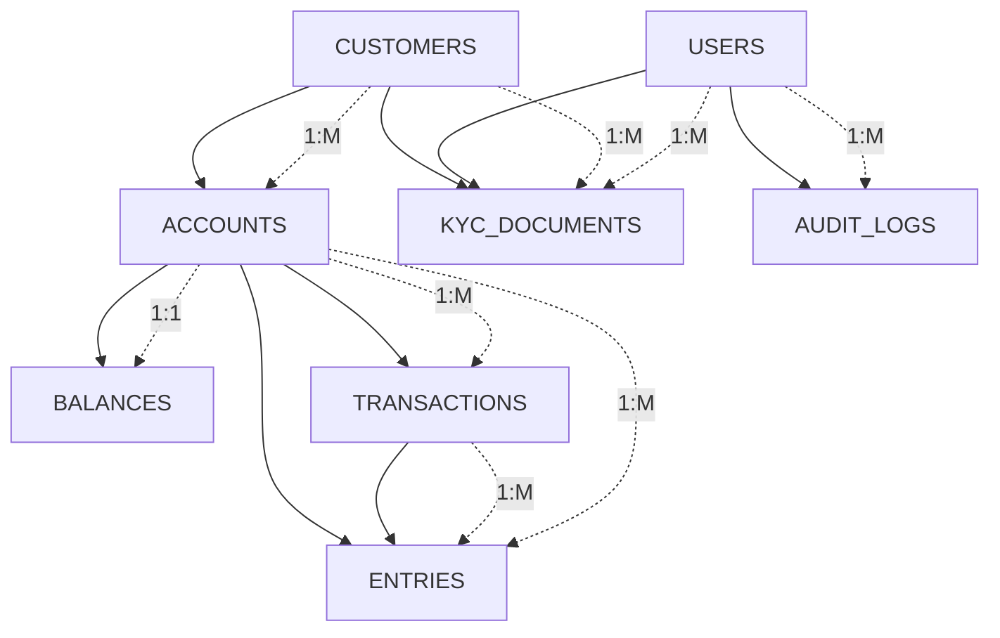
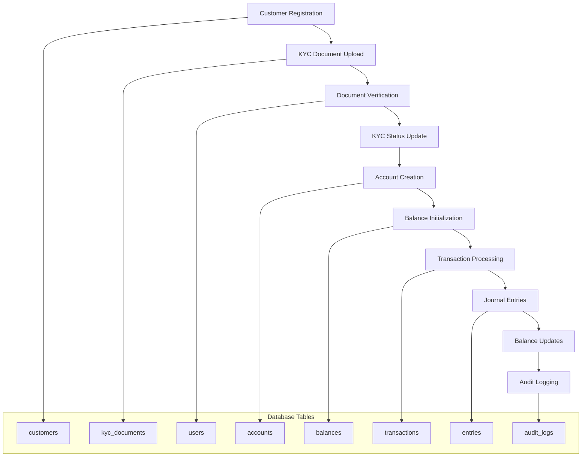

# CoreX Banking System - Mermaid ERD

## Entity Relationship Diagram (Mermaid Format)

```mermaid
erDiagram
    CUSTOMERS {
        uuid id PK
        varchar customer_number UK
        varchar first_name
        varchar last_name
        varchar email UK
        varchar phone
        date date_of_birth
        text address
        varchar city
        varchar country
        varchar occupation
        varchar income_range
        enum kyc_status
        enum status
        timestamp created_at
        timestamp updated_at
    }

    USERS {
        uuid id PK
        varchar username UK
        varchar email UK
        varchar password_hash
        enum role
        enum status
        timestamp created_at
    }

    ACCOUNTS {
        uuid id PK
        varchar account_number UK
        uuid customer_id FK
        enum account_type
        varchar currency
        enum status
        timestamp created_at
        timestamp updated_at
    }

    KYC_DOCUMENTS {
        uuid id PK
        uuid customer_id FK
        enum document_type
        varchar document_number
        varchar file_path
        enum status
        uuid verified_by FK
        text rejection_reason
        timestamp expires_at
        timestamp created_at
        timestamp updated_at
    }

    BALANCES {
        uuid account_id PK_FK
        decimal ledger_balance
        decimal available_balance
        timestamp updated_at
    }

    TRANSACTIONS {
        uuid id PK
        varchar transaction_id UK
        uuid from_account_id FK
        uuid to_account_id FK
        decimal amount
        varchar currency
        enum transaction_type
        text description
        enum status
        timestamp created_at
        timestamp processed_at
    }

    ENTRIES {
        uuid id PK
        uuid transaction_id FK
        uuid account_id FK
        enum entry_type
        decimal amount
        timestamp created_at
    }

    AUDIT_LOGS {
        uuid id PK
        uuid user_id FK
        varchar action
        varchar resource_type
        uuid resource_id
        json details
        timestamp created_at
    }

    %% Relationships
    CUSTOMERS ||--o{ ACCOUNTS : "owns"
    CUSTOMERS ||--o{ KYC_DOCUMENTS : "submits"
    USERS ||--o{ KYC_DOCUMENTS : "verifies"
    USERS ||--o{ AUDIT_LOGS : "creates"
    ACCOUNTS ||--|| BALANCES : "has"
    ACCOUNTS ||--o{ TRANSACTIONS : "from_account"
    ACCOUNTS ||--o{ TRANSACTIONS : "to_account"
    ACCOUNTS ||--o{ ENTRIES : "affects"
    TRANSACTIONS ||--o{ ENTRIES : "generates"
```

## Simplified Relationship View



## Database Flow Diagram

